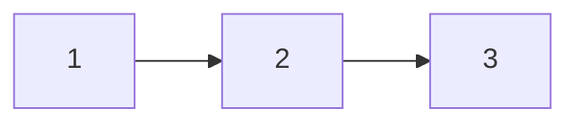
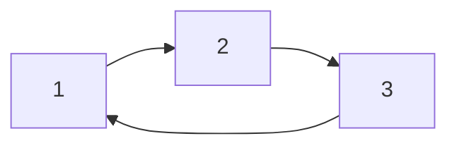
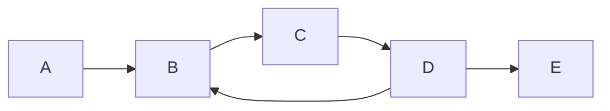
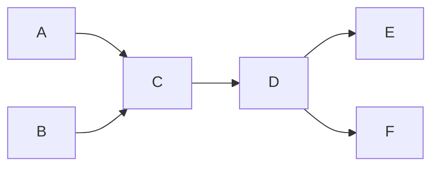
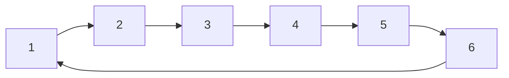

# Research Meeting Notes - November 4, 2025 (Morning)

## Date
November 4, 2025 (Morning Meeting)

## Key Insight

**Tree Structure vs. Cycles in GMRF Correlation Analysis**: The fundamental distinction between tree graphs and graphs with cycles has critical implications for correlation estimation in mobility networks. In tree structures, conditional and unconditional correlations are equivalent because every edge is a bridge - removing any connection causes the graph to disconnect completely. This means the correlation between any two nodes depends only on their direct linkage path, not on alternative routes through the network.

However, in graphs with cycles, nodes can be connected through multiple pathways. This creates a divergence between conditional correlations (controlling for immediate neighbors, as in GMRF framework) and unconditional correlations (accounting for all possible connection paths). The presence of cycles means that correlation between nodes depends not only on their direct connection but also on longer alternative paths that may strengthen their overall correlation.

## Mathematical Framework

### Regular AR(1) Model (Tree Structure)

Consider a standard AR(1) process on a tree:

The model can be written as:
$$y_{t} = \rho y_{t-1} + e_t$$

In matrix form: $\mathbf y = \rho\mathbb L \mathbf y +\mathbf e$, so that $\mathbf y = (\mathbf I- \rho\mathbb L)^{-1}\mathbf e$.

The precision matrix is:
$$\mathbf I - \rho\mathbb L = \begin{bmatrix}1 & 0 & 0\\-\rho & 1 & 0\\0 & -\rho & 1\end{bmatrix}$$

The propagation matrix is:
$$\mathbf P =(\mathbf I - \rho \mathbb L)^{-1} =\begin{bmatrix}1 & 0 & 0\\\rho & 1 & 0\\\rho^2 & \rho & 1\end{bmatrix}$$

With variance structure $\mathbf\Sigma =\text{diag}(1/(1-\rho^2), 1, 1)$, the variance-covariance matrix is:
$$\mathbb E (\mathbf{yy}') = \mathbf P\mathbf\Sigma \mathbf P' = \frac{1}{1-\rho^2} \begin{bmatrix} 1 & \rho & \rho^2\\ \rho & 1 & \rho\\ \rho^2 & \rho & 1 \end{bmatrix}$$

Note the characteristic pattern: correlation decays as $\rho^k$ where $k$ is the path length (number of hops).

### Cycle Model ("Snake" AR(1))

Consider an AR(1) process on a 3-cycle:

With the same AR(1) structure but $t=1$ mapping to $t-1=3$ (the "Christopher Nolan Moment"), the precision matrix becomes:
$$\mathbf I - \rho\mathbb L = \begin{bmatrix}1 & 0 & -\rho\\-\rho & 1 & 0\\0 & -\rho & 1\end{bmatrix}$$

The propagation matrix is:
$$\mathbf P = \frac{1}{1-\rho^3}\begin{bmatrix}1 & \rho^2 & \rho\\\rho & 1 & \rho^2\\\rho^2 & \rho & 1\end{bmatrix}$$

With iid innovations ($\mathbf \Sigma = \mathbf I$), the variance-covariance matrix is:
$$\mathbb E (\mathbf{yy}') = \mathbf P \mathbf P' =\frac{1}{(1-\rho^3)^2}\,\mathbf M \mathbf M',\quad\mathbf M=\begin{bmatrix}1 & \rho^2 & \rho\\\rho & 1 & \rho^2\\\rho^2 & \rho & 1\end{bmatrix}$$

Expanding $\mathbf M\mathbf M'$:
$$\mathbf M\mathbf M'=\begin{bmatrix}1+\rho^2+\rho^4 & \rho(1+\rho+\rho^2) & \rho(1+\rho+\rho^2)\\\rho(1+\rho+\rho^2) & 1+\rho^2+\rho^4 & \rho(1+\rho+\rho^2)\\\rho(1+\rho+\rho^2) & \rho(1+\rho+\rho^2) & 1+\rho^2+\rho^4\end{bmatrix}$$

The correlation between adjacent nodes is:
$$\operatorname{Corr}(y_1,y_2)=\frac{\rho(1+\rho+\rho^2)}{1+\rho^2+\rho^4},\qquad \rho^3\neq 1$$

**Critical difference**: This correlation does not equal $\rho$ as in the tree case. The cycle structure amplifies correlation through the alternative path. For $\rho > 0$, we have $\operatorname{Corr}(y_1,y_2) > \rho$, showing that cycles increase correlation strength beyond what tree-based theory predicts.

### Simulating GMRF via Power Series

The propagation matrix can be approximated using the Neumann series:
$$(\mathbf I - \rho\mathbb L)^{-1}= \mathbf I + \rho\mathbb L + \rho^2\mathbb L^2+\cdots =\lim_{K\to\infty}\sum_{k=0}^K \rho^k\mathbb L^k$$

For simulation, truncate at finite $K$ to approximate the infinite sum.

### Example Graphs for Testing

**Tree with cycle extension:**

**Pure tree:**

**Longer cycle (afternoon session):**

## Technical Issues

**Four-Hop Path Bias in Cycles**: The estimation strategy using four-hop paths may be systematically biased toward cycle-rich regions of the network, where such longer paths are more common. In tree structures, 4-hop covariances equal $\rho^2$ times 2-hop covariances. However, cycles create multiple paths of varying lengths between the same nodes, increasing correlation strength beyond the $\rho^k$ decay pattern. This could explain why empirical four-hop moments deviate from expected $\rho^2$ scaling.

**GMRF Conditional Independence Assumption**: The Gaussian Markov Random Field framework assumes that correlation between nodes depends only on immediate neighbors (conditional independence). This holds for tree structures where the Markov property applies: conditioning on an intermediate node blocks all paths. In graphs with cycles, conditioning on neighbors does not block all paths, violating the conditional independence assumption.

**Simulation Code Problems**: The existing Julia simulation code produces correlation estimates near unity in some configurations. This requires debugging to ensure proper implementation of the propagation matrix inversion, particularly for different graph topologies (trees vs. cycles vs. general structures).

## Action Items

1. **Monte Carlo Simulation Framework**: Develop a controlled simulation environment using simple, undirected graphs (not bipartite initially) with shocks at nodes. Test various graph topologies:
   - Pure trees (3-node chain, star graphs)
   - Simple cycles (3-cycle, 6-cycle)
   - Combinations (tree with attached cycle)
   - Compare analytical correlations to simulated correlations

2. **Analytical Correlation Formulas**: For each test graph topology, derive the exact variance-covariance matrix analytically using $\mathbb E (\mathbf{yy}') = \mathbf P\mathbf\Sigma \mathbf P'$ where $\mathbf P = (\mathbf I - \rho\mathbb L)^{-1}$. Use these as ground truth for validating simulation code.

3. **GMM Training Implementation**: Use the simulation framework to practice and validate the GMM estimation procedure on known graph structures. Test whether standard GMM can recover $\rho$ when the true graph contains cycles or whether bias emerges.

4. **Code Review and Debugging**: Systematically review the existing Julia code to identify sources of the correlation estimates near unity. Verify:
   - Matrix inversion for $(\mathbf I - \rho\mathbb L)^{-1}$
   - Variance initialization (steady-state vs. iid innovations)
   - Path counting algorithms for n-hop covariances

5. **Theoretical Development**: Formalize the relationship between graph topology (tree vs. general structure) and the validity of path-length decay assumptions in mobility network estimation. Determine conditions under which the $\rho^2$ scaling holds or fails.

## Open Questions

**Identification Strategy Validity**: Does the identification strategy based on path-length decay (4-hop vs. 2-hop covariances) remain valid when the underlying network contains cycles? The tree-based theory predicts $C_{\text{mm},4} = \rho^2 \cdot C_{\text{mm},2}$, but cycles may create correlation reinforcement that violates this exact scaling relationship.

**Cycle Prevalence in Bipartite Projections**: What is the actual prevalence of cycles in the projected single-mode networks derived from bipartite manager-firm mobility data? The bipartite structure constrains cycle length (all cycles must be even), but the projection process may create dense cycle structures. Empirical analysis of the Hungarian CEO mobility network topology is needed.

**Bias Direction and Magnitude**: If cycles violate the $\rho^2$ scaling assumption, does this create upward or downward bias in $\hat{\rho}$? The 3-cycle example shows that cycles amplify correlation ($\text{Corr} > \rho$), suggesting that ignoring cycles may lead to overestimation of sorting strength when using the tree-based formula.

**Alternative Estimation Approaches**: If GMRF assumptions are violated by network cycles, what alternative frameworks can properly model correlation in general graph structures while maintaining tractable estimation procedures? Options include:
   - Full maximum likelihood using exact inverse $(\mathbf I - \rho\mathbb L)^{-1}$
   - Cycle-adjusted moment conditions accounting for multiple paths
   - Semi-parametric approaches that avoid distributional assumptions
